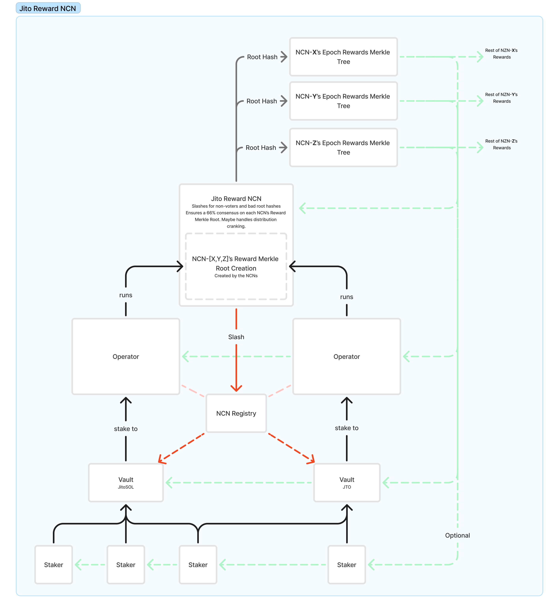
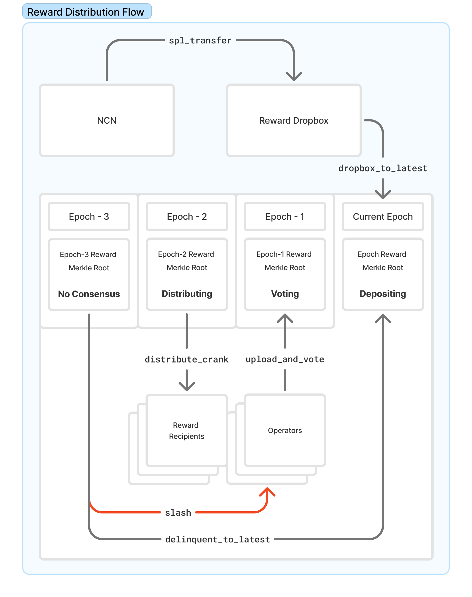

# Jito Rewards NCN

WORK IN PROGRESS - **Nothing is finalized** and is mostly chicken scratch for the developers.

## Overview

The Jito Rewards NCN is an NCN that helps other NCNs distribute rewards.

### During Epoch

1. Rewards of any type are deposited to a `EpochRewardMerkleRoot` account at anytime during it’s epoch (on epoch rollover a new `EpochRewardMerkleRoot` will be created and deposited to ). For ease-of-use, they can be deposited to the `RewardDropbox` PDA for a given NCN.

### After Epoch

1. A `WeightTable` is created and finalized to determine the voting weight of each base asset
2. Reward NCN takes a solana snapshot of the last slot of the previous epoch  
3. Operators run a customized Reward Merkle Root Creation script that creates a merkle root of all of the rewards and their destinations for the previous epoch.  
4. Operators then vote on correct root hash, coming to a 66% consensus within `valid_voting_slots`  
5. On valid consensus, rewards can be distributed by a permissionless crank instruction handled by the Reward NCN
6. If no consensus is reached, rewards can be transferred to the current epoch’s rewards

### Slashing

Suggestions for slashing:

- Operators can get slashed if they did not vote within the voting window  
- If no consensus is reached, all operators are slashed  
- If the minimum vote count is not reached, all delinquent operators are slashed

### Rewards

The Rewards NCN will bake in fees negotiated with partner NCNs using the Rewards program within the root hash

### Consensus



## Off-Chain Programs

### Merkle Root Creation

Once per epoch (defined by the vault program config) the snapshot of the last slot per the epoch will be taken. This snapshot is to be used to create the merkle tree of rewards for the NCN. This off-chain code will be provided on a per-NCN basis. Either created by Jito’s partners or by Jito on the partners behalf.

This software will be run by all operators within the Reward NCN, all operators then cast their stake-weighted vote for their merkle root using the on-Chain program. At 66% consensus, the merkle root for that epoch will be finalized and the Keeper will run to distribute the rewards.

#### Rewards

In running this Merkle Root Creation software, the Jito Reward NCN will also bake in fees/accounts to reward the running of itself.

#### Normalizing Prices

When determining the stake weight for NCNs with multiple vault asset types, it is recommended to normalize the price of said assets to SOL using Switchboard’s on-chain prices. This data is stored per epoch in a `WeightTable`

### Distributor/Cranker

Cranks the distribution of valid rewards, as well as cleans up old accounts.

## On-Chain Program

### Accounts

- `EpochRewardMerkleRoot`: Hold the funds (of any asset ) for distribution as well as the voted on roots. Funds can only be deposited into this account during it’s own epoch. Voting takes place after deposits are closed and lasts for X slots.  
- `EpochMerkleRootTicket`: account that holds the vote for a given operator.  
- `WeightTable`: keeps a normalization table for each asset type staked to the NCN  
- `RewardConfig`: Either a global or per NCN config.  
- `DisributionMarker`: Account to mark that a distribution has been made  
- `RewardDropbox`: PDA for a given NCN, they can freely transfer any asset to that can be added to the current epoch’s `EpochRewardMerkleRoot` with the permissionless `dropbox_to_latest` instruction

```rust
// PDA'd [ncn, epoch_slot]
pub struct EpochRewardMerkleRoot {
 ncn: Pubkey,
epoch_slot_start: u64,
epoch_slot_end: u64,
reward_payout_count: u64 // How many times the `distribute_crank` was called
     roots: [([u8; 32], [(u64, Pubkey), vaults.unique_mint_count]); MAX_ROOTS] // hash + amount of stake (or pro-rata share of stake) voting on that root.
}

// PDA'd [ncn, epoch_slot, operator]
struct EpochRewardMerkleRootTicket {
     ncn: Pubkey,
     operator: Pubkey,
     epoch_slot: u64,
 stake: u64,
     root: [u8; 32],
 stake: [(u64, Pubkey), vaults.unique_mint_count]
     merkle_tree_link: String
}

// PDA'd [epoch_reward_merkle_root, epoch_slot,  mint, recipient]
struct DisributionMarker {
// 0 byte account 
}

// PDA [ncn]
pub struct RewardDropbox {
}

struct RewardConfig {
 valid_voting_slots: u64 // amount of slots voting is valid for after an epoch ends
 slots_before_closing_marker_accounts: u64 // amount of slots before a marker account can be closed
}
```

### Instructions

- `deposit_rewards`: deposits rewards to `EpochRewardMerkleRoot`  
- `upload_and_vote`: creates and or modifies the operator’s `EpochRewardMerkleRootTicket` \- can be modified or created within the window of the last\_epoch\_slot \-\> valid\_voting\_slots  
- `slash`: if one of the slashing conditions is met, create a slash ticket.  
- `dropbox_to_latest`: For routing purposes, we can have all rewards, at any time be deposited to the `RewardDropbox`, these assets can permissionless be transferred to the latest `EpochRewardMerkleRoot`  
- `delinquent_to_latest`: In the case of consensus not being reached, the rewards from this epoch can be transferred to the current rewards.  
- `distribute_crank`: Distributes rewards from a valid `EpochRewardMerkleRoot` using the consensus root hash as proof. This function will create a `DisributionMarker` account  
- `close_marker_account(s)`: Instructions to close all 0-byte marker accounts for older than `slots_before_closing_marker_accounts`

### Reward Distribution



#### Keeping Track of who has been redeemed

Options:

1. Create a 0-byte account PDA’d with [epoch_reward_merkle_root, epoch_slot, mint, recipient]
2. Index the Merkle Tree and use a very large bitmask to determine who has been redeemed
3. Use compressed state

#### Routing?

`RewardDropbox` can have it’s contents permissionless-ly moved into the current `EpochRewardMerkleRoot`

## Exact Steps

When a new epoch is started:

1. A new `EpochRewardMerkleRoot` needs to be created with `initialize_epoch_reward_merkle_root`

2. During the epoch, all of the rewards to be distributed are sent to the `EpochRewardMerkleRoot` or for ease-of-use the `RewardDropbox` which are routed to the `EpochRewardMerkleRoot` via cranks
3. After the epoch is done, the operators will have `voting_slots` for each operator to create a new `EpochRewardMerkleRootTicket` that needs to be created with `epoch_reward_merkle_root_vote`, then they must cast their vote
   - `update_ticket_stake` needs to be called for each supported mint for the ncn ( This just updates the current stake )
   - `submit_ticket` this will update the roots
